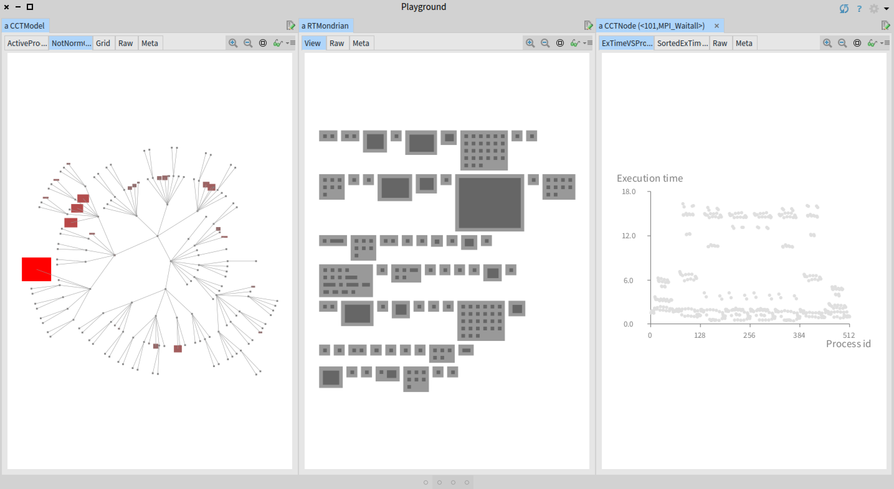

# HPCVisualization
This Pharo project visualize the Zeus dataset

The folder `data` contains the dataset from the computational fluid dynamics code  https://www.spec.org/auto/mpi2007/Docs/132.zeusmp2.html

Here is a picture:

The left-most pane represents the calling context tree used in the Zeus benchmark. The size and color of each node indicates the time spent in it. The middle pane represent the context node grouped by their functions (a same function can appear in several contexts). The right most pane indicates the occurence of the context node across 512 different cores.
